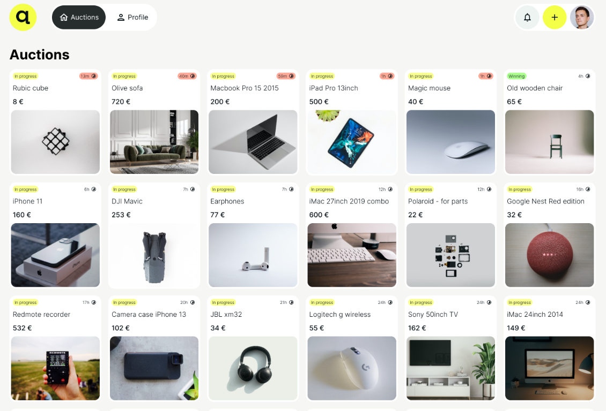

# 🎨 AuctionBay — Frontend (React + Vite + TypeScript)

  
> *(Insert your cover image here — e.g. app screenshot or banner)*  

Responsive and modern **frontend for AuctionBay**, a full-stack online auction platform.  
Includes authentication, profile management, auctions listing/detail, bidding system, and profile tabs (My / Bidding / Won).

🌐 **Live Demo:** [https://auctionbay-project.netlify.app/](https://auctionbay-project.netlify.app/)

---

## ⚙️ Table of Contents

- [✨ Features](#-features)
- [🧩 Architecture & Tech](#-architecture--tech)
- [📦 Prerequisites](#-prerequisites)
- [⚙️ Environment](#-environment)
- [🧰 Install](#-install)
- [🚀 Run](#-run)
- [🏗️ Build](#-build)
- [📁 Project Structure](#-project-structure)
- [🎨 UI & Styling](#-ui--styling)
- [🔗 API Integration](#-api-integration)
- [👤 Profile & Modals](#-profile--modals)

---

## ✨ Features

- 🔐 **Authentication** — register, login, forgot password, update password (JWT cookie-based).
- 👤 **Profile management** — update name, email, password, and change avatar (AWS S3 upload).
- 🧩 **Auctions**
  - Create/edit/delete auctions with image upload and end date.
  - Auction detail view with real-time bidding history.
  - Tabs: “My auctions”, “Bidding”, and “Won” with empty states.
- 💰 **Bidding** — enforces min bid (≥ highest + 1), blocks ended auctions, instant bid list updates.
- 📱 **Responsive UI** — fully adaptive layout following Figma design fidelity.
- 🔔 **Notifications** — toast messages for validation errors and success feedback.

---

## 🧩 Architecture & Tech

- **React 18** + **Vite**  
- **TypeScript** (strict mode)
- **State Management:** MobX (`authStore`)
- **Forms:** react-hook-form + Yup validation
- **Styling:** styled-components  
- **Routing:** react-router-dom  
- **Icons:** lucide-react  
- **Build:** Vite optimized (ESM, fast refresh)
- **Data Fetching:** Axios with `withCredentials` for JWT cookies  

---

## 📦 Prerequisites

- Node.js **18+**
- npm **9+**

---

## ⚙️ Environment

Create a `.env` file in the project root:

```env
# Local backend
VITE_API_URL=http://localhost:3000

# or production
# VITE_API_URL=https://auctionbay-backend-dogi.onrender.com
```

> The backend must have CORS enabled for your frontend URL (both local and deployed).

---

## 🧰 Install

```bash
npm install
```

---

## 🚀 Run

```bash
# development
npm run dev
```

Frontend dev server runs on **http://localhost:5173** (default Vite).

---

## 🏗️ Build

```bash
# production build
npm run build

# preview production build locally
npm run preview
```

---

## 📁 Project Structure

```
auctionbay-frontend/
├─ public/                  # static assets (logo, cover image)
├─ src/
│  ├─ assets/               # icons, images
│  ├─ components/
│  │  ├─ AuctionCard.tsx
│  │  ├─ AuctionDetailView.tsx
│  │  ├─ Navbar/
│  │  ├─ Profile/
│  │  └─ User/              # login/register/forgot/change-password forms
│  ├─ hooks/                # e.g. useMyAuctions, useLogin, useRegister
│  ├─ services/             # axios wrappers (auction, user, auth)
│  ├─ stores/               # MobX stores (authStore)
│  ├─ types/                # shared TS types (Auction, User, Bid)
│  ├─ utils/                # helpers (date formatting, etc.)
│  ├─ App.tsx
│  └─ main.tsx
├─ .env
├─ package.json
└─ README.md
```

---

## 🎨 UI & Styling

- Built using **styled-components** for modular, scoped styles.  
- **Design fidelity:** based on Figma mockups (consistent spacing, typography, responsiveness).  
- **Reusable components:**  
  - `InputField`, `FormLayout`, `Button`, `Card`, `ToastMessage`.  
- Integrated with `lucide-react` icons and shadcn-inspired patterns.

---

## 🔗 API Integration

- Axios instance configured with `VITE_API_URL`.
- All requests include credentials (`withCredentials: true`) for JWT cookies.
- Endpoints consumed:
  - `auth`: register, login, logout, refresh, change password
  - `user`: update profile, upload avatar (AWS S3)
  - `auction`: CRUD, bidding, and fetching details

> Local: `http://localhost:3000`  
> Production: `https://auctionbay-backend-dogi.onrender.com`

---

## 👤 Profile & Modals

- **ProfileSettingsModal:** edit user info  
- **ChangePasswordModal:** update password securely  
- **ChangeAvatarModal:** upload & preview new profile picture (via S3)  
- **EditAuctionModal:** edit auction title, description, end date, and image  
  - Starting bid locked once first bid is placed  

---

## 🌍 Deployment Overview

| Environment | Platform | URL |
|--------------|-----------|------|
| Frontend | Netlify | [auctionbay-project.netlify.app](https://auctionbay-project.netlify.app) |
| Backend | Render | [auctionbay-backend-dogi.onrender.com](https://auctionbay-backend-dogi.onrender.com) |
| Storage | AWS S3 | `auctionbay-uploads` |

---

## 🧠 Notes & Best Practices

- Always ensure the backend’s `CORS_ORIGIN` matches your frontend URL.  
- Never expose secrets or AWS keys in frontend `.env`.  
- Use consistent date format (`DD.MM.YYYY`) across forms and API.  
- Use MobX’s observable stores to keep user state in sync after updates.

---

Made with ❤️ using **React**, **TypeScript**, **Vite**, and **styled-components**.
